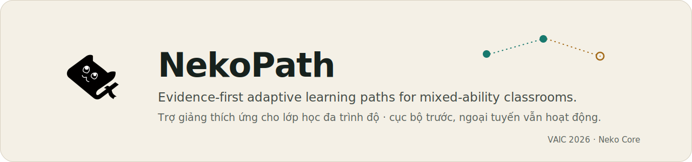
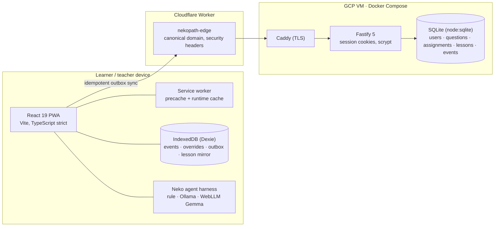

<p align="center">
  
</p>

<p align="center">
  <a href="https://github.com/meiiie/neko-core-vaic-2026/actions/workflows/ci.yml"></a>
  <a href="https://github.com/meiiie/neko-core-vaic-2026/releases"></a>
  <a href="LICENSE"></a>
  
  
  
</p>

<p align="center">
  <a href="https://nekopath.holilihu.online">Live product</a> ·
  <a href="#getting-started">Getting started</a> ·
  <a href="#architecture">Architecture</a> ·
  <a href="#documentation">Documentation</a> ·
  <a href="CHANGELOG.md">Changelog</a> ·
  <a href="#tóm-tắt-tiếng-việt">Tiếng Việt</a>
</p>

---

NekoPath diagnoses the earliest actionable prerequisite gap behind a learner's current mistake,
asks for more evidence when the cause is ambiguous instead of guessing, and gives the teacher a
prioritized, correctable intervention plan that fits a finite attention budget. Learners who have
already mastered the target take a fast path instead of repeating a fixed lesson sequence.

Built in 48 hours for **VAIC 2026** (problem: *Adaptive tutor for the mixed-ability classroom*,
Duy Tan University, Education & Training track) by team **Neko Core**.

## Live deployment

| Surface | URL | Notes |
|---|---|---|
| Product | [nekopath.holilihu.online](https://nekopath.holilihu.online) | Canonical domain, HTTPS, installable PWA |
| Health | [/api/healthz](https://nekopath.holilihu.online/api/healthz) | Fastify liveness (`status` and server time) |
| Sign-in | Class-roll picker | Event walkthrough access; no password typing or external identity provider |

The class roll and learning events are server-backed sample records, not learner PII. The
one-click event walkthrough is intentionally **not** presented as a production identity or
security boundary.

## Why this design fits the problem

- **Root-cause diagnosis, not answer checking.** Correctness, method validity and authored
  misconception evidence are tracked separately; a repeated misconception must be seen on two
  independent items before the interface names it.
- **Honest uncertainty.** When evidence is insufficient the system abstains
  (`NEEDS_MORE_EVIDENCE`) and asks one discriminating question instead of mislabeling the child.
- **The teacher stays in command.** A mandatory dashboard groups the class by need, verifies
  suspected patterns, and selects interventions under an explicit 15-minute teacher budget.
- **Works where the network does not.** Rural, low-bandwidth classrooms are the stated user:
  diagnosis, paths and the authored practice flow continue from IndexedDB after first load, and
  learning events sync through an idempotent outbox when connectivity returns. Server-owned
  authoring and assignment operations still require a connection.
- **Curriculum-bounded.** The judgeable fractions-to-proportion slice is drafted against GDPT
  2018 (Toán 7); its edges, items and wording remain `UNREVIEWED` until a named mathematics
  teacher signs them off.

## Product capabilities

**Student workspace** — adaptive check-in that spends a bounded question budget, an evidence-based
learning path with explicit reasons per step, per-skill lesson summaries that open offline from
the device mirror, mastery-driven practice with a three-level hint ladder, and teacher-assigned
homework with due dates and retake policy. Evidence follows the account: a student's append-only
history rehydrates on any device they sign into.

**Teacher workspace** — class overview grouped by need over real synced records, per-learner
evidence tracing (every decision opens down to the answers behind it), misconception verification
queue, question authoring, **lesson-material authoring** (team-seeded drafts the teacher edits and
publishes under their own name, distributed to student devices for offline reading), and
assignment creation and monitoring — all computed from the same deterministic domain core the
student surfaces use.

**Neko assistant** — a persistent, evidence-first console docked on the right. Its canonical
memory compacts under estimated token pressure rather than expiring after a fixed number of turns.
The same strict provider port supports the deterministic offline rule agent, local Ollama, Gemma 3
running in-browser through WebLLM, server-side OpenAI Responses, and optional local/self-hosted
ChatGPT managed login through the official Codex App Server protocol. Bounded tool steps, strict
runtime schemas, stuck-loop detection and a grounding guard replace unsupported claims with
deterministic evidence.

## Architecture



Design decisions that matter:

- **Local-first, then sync.** Core diagnosis, paths and practice continue with zero connectivity;
  the outbox replays events with exponential backoff and event-ID idempotency, so the server
  converges without duplicates.
- **Deterministic domain core.** Diagnosis, grouping and mastery are pure TypeScript functions
  with a disclosed synthetic evaluation suite — the UI renders runtime results, never hard-coded
  outcomes.
- **Sessions over tokens.** HttpOnly, SameSite session cookies instead of JWT-in-localStorage.
- **Offline entry without offline credentials.** After a successful server login, the device keeps
  only a sanitized profile (email, local `id`, name, initials, `shortName`, role, subtitle and the
  optional local learner key). If the directory is unreachable, users may reopen only profiles
  already confirmed on that device; no password, session cookie or API response is copied into web
  storage or the service-worker cache.
- **Zero native dependencies.** `node:sqlite` keeps the image small and the Docker build
  reproducible; the Docker build is the release gate.
- **System font stack.** Zero download on 2G and native Vietnamese diacritic shaping on every
  platform.

### Where the AI actually is

NekoPath's core AI is not a chatbot. It is a **probabilistic learner model plus a
graph-constrained decision engine**. Student diagnosis runs on the device; the server-backed
teacher dashboard invokes the same pure domain core over account-scoped evidence:

1. A Bayesian Knowledge Tracing–style learner model (versioned slip/guess/learn parameters,
   deterministic over the canonicalized event log) updates mastery estimates after every answer.
2. A diagnostic probe selector picks the next question by expected information gain, under a
   bounded question budget.
3. A root-cause engine searches the reviewed prerequisite graph for the earliest actionable,
   evidence-supported gap — and returns `NEEDS_MORE_EVIDENCE` rather than guess when evidence
   is insufficient or contradictory.
4. A path planner emits the minimal valid remediation path (fewest skills needing work on a
   valid route, never skipping an unmet prerequisite).
5. A teacher-intelligence layer aggregates transparent priorities
   (`affected learners × blocked downstream skills`) and class-wide gaps with explicit
   denominators.

The optional language model (rule agent, local Ollama, or in-browser Gemma via WebLLM) only
narrates results this pipeline has already computed. It never decides answer keys, mastery,
root causes, learning paths, or priorities, and a grounding guard replaces any drifting output
with a deterministic fallback.

## Getting started

Prerequisites: Node.js `24.18.0` (LTS, see `.nvmrc`), npm 11.

```bash
npm ci
npm run seed     # create and seed the local SQLite database
npm run server   # Fastify API on port 3001
npm run dev      # Vite dev server (proxies /api to the local API)
npm run test     # 167 application and integration tests (Vitest)
npm run eval     # 29 disclosed synthetic evaluation tests
npm run build    # type-checked production build
npm run verify   # complete local verification in one command
```

`npm run verify` runs format, lint, typecheck, application tests, eval and build. CI repeats those
steps and additionally validates operations scripts and the generated PWA artifacts.

## Quality and release engineering

- **CI** (`.github/workflows/ci.yml`): SHA-pinned actions, least-privilege permissions, the
  complete gate on every push and pull request.
- **Deploy** (`.github/workflows/deploy.yml`): the pipeline is the **only** sanctioned release
  path (`gh workflow run deploy.yml`) — keyless GitHub OIDC/Google Workload Identity Federation,
  IAP-tunneled from GitHub's runners, serialized, smoke-tested; the Docker build is the release
  gate. Hand SSH is reported break-glass only (see
  [ENGINEERING_STANDARDS.md](docs/ENGINEERING_STANDARDS.md)). The in-product version surface
  reports the immutable Git SHA; `/api/healthz` reports liveness and server time.
- **Versioning**: semantic versions, annotated tags, and published
  [GitHub Releases](https://github.com/meiiie/neko-core-vaic-2026/releases); history in
  [CHANGELOG.md](CHANGELOG.md).
- **Honest evaluation**: synthetic Brier/ECE gates are disclosed in
  [docs/EVALUATION.md](docs/EVALUATION.md). No real-learning, whole-curriculum or SOTA claim is
  made; named curriculum review and independently owned held-out labels remain explicit next
  gates.

## Repository structure

```text
src/            React PWA — app shell, student/teacher features, agent dock
src/domain/     Deterministic diagnosis, grouping and mastery core
server/         Fastify API, SQLite schema/migrations, seed data
edge/           Cloudflare Worker for the canonical domain
ops/            Docker Compose, Caddy, deployment runbook
docs/           Product, design, evaluation and brand documentation
tests/eval/     Disclosed synthetic evaluation suite
labs/           Image-generation lab with asset register and review rubric
```

## Documentation

| Document | Purpose |
|---|---|
| [PROBLEM_ANALYSIS.md](docs/PROBLEM_ANALYSIS.md) | What the official problem does and does not state |
| [PRODUCT_CONTRACT.md](docs/PRODUCT_CONTRACT.md) | The 48-hour product contract |
| [IMPLEMENTATION_MASTER_PLAN.md](docs/IMPLEMENTATION_MASTER_PLAN.md) | Technical plan and lane boundaries |
| [PRODUCT_UI_CONSTITUTION.md](docs/PRODUCT_UI_CONSTITUTION.md) | Non-negotiable UI rules |
| [BRAND_SYSTEM.md](docs/BRAND_SYSTEM.md) | Identity, palette, mark governance |
| [OPERATIONAL_MVP.md](docs/OPERATIONAL_MVP.md) | Role-based MVP scope |
| [EVALUATION.md](docs/EVALUATION.md) | Evaluation status and reproducibility |
| [EXECUTIVE_CONCLUSION_EXECUTION.md](docs/EXECUTIVE_CONCLUSION_EXECUTION.md) | Evidence-aware adaptive core rationale |
| [Teacher AI harness v2](docs/superpowers/specs/2026-07-18-neko-teacher-ai-harness-v2-design.md) | Agent memory, provider and security design |
| [Agentic vertical slice](docs/superpowers/plans/2026-07-18-neko-agentic-vertical-slice.md) | Implementation and verification record |
| [DEPLOYMENT_STATUS.md](docs/DEPLOYMENT_STATUS.md) | Production topology and verification |
| [DEMO_SCRIPT.md](docs/DEMO_SCRIPT.md) | Submission video script with claim discipline |
| [PROBLEM_FIT_AUDIT.md](docs/PROBLEM_FIT_AUDIT.md) | Requirement-by-requirement technical audit with measurements |
| [ENGINEERING_STANDARDS.md](docs/ENGINEERING_STANDARDS.md) | Team delivery rules benchmarked against industry practice |
| [ARCHITECTURE_REVIEW_VS_LMS.md](docs/ARCHITECTURE_REVIEW_VS_LMS.md) | Honest architecture review against the team's mature LMS |
| [CURRICULUM_SCOPE_DECISIONS.md](docs/CURRICULUM_SCOPE_DECISIONS.md) | Team-lead-approved curriculum scope and architecture decisions |
| [ops/RUNBOOK.md](ops/RUNBOOK.md) | Operations: deploy, accounts, recovery |

## Team and AI collaboration

NekoPath is built by **Neko Core** with disclosed AI pair-engineering (Claude Fable 5 and OpenAI
Codex working in reviewed lanes). Every significant AI contribution — task, files touched,
verification result and open risk — is recorded in
[AI_COLLABORATION_LOG.csv](AI_COLLABORATION_LOG.csv), as required by the organizers.

The official problem text is intentionally short. Anything not stated there is an internal
hypothesis and is labeled as such throughout the documentation.

## Tóm tắt tiếng Việt

NekoPath là trợ giảng thích ứng cho lớp học đa trình độ: lần theo lỗi hiện tại của học sinh về
đúng lỗ hổng kiến thức gốc sớm nhất có thể can thiệp, chủ động **hỏi thêm khi chưa đủ bằng
chứng** thay vì gán nhãn sai, và trao cho giáo viên một kế hoạch can thiệp xếp ưu tiên trong
ngân sách 15 phút. Giáo viên tự soạn câu hỏi, giao bài và **biên soạn học liệu tóm tắt theo từng
kỹ năng** — tài liệu xuất bản dưới tên giáo viên và được phát tới thiết bị học sinh để đọc cả
khi mất mạng. Ứng dụng là PWA **cục bộ trước**: chẩn đoán, lộ trình và luyện tập cốt lõi tiếp
tục khi mất mạng rồi tự đồng bộ sự kiện khi có kết nối (chống trùng lặp, cách ly xung đột); lịch
sử học theo tài khoản nên đổi thiết bị vẫn khôi phục được. Các thao tác do máy chủ sở hữu vẫn
cần mạng. Lát cắt Toán 7 được biên soạn theo định hướng GDPT 2018 nhưng còn chờ giáo viên được
nêu tên duyệt chính thức. Đăng nhập trình diễn bằng cách chọn tên trong danh sách lớp, không cần
gõ mật khẩu và không được xem là ranh giới định danh bảo mật cho triển khai trường học thật.
Neko ghi nhớ theo phiên và nén theo ngân sách token, không tự xóa ngữ cảnh sau một số lượt cố định.

## License

Released under the [MIT License](LICENSE). The NekoPath name and feline mark are team identity
assets governed by [docs/BRAND_SYSTEM.md](docs/BRAND_SYSTEM.md).
