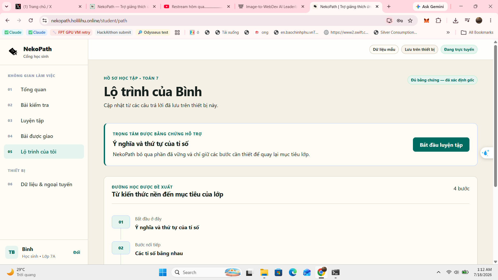

# NekoPath sidebar audit — 2026-07-18

## Audit scope

- Surface: student desktop sidebar on `/student/path`.
- Evidence: screenshot supplied by the human captain and inspected at original resolution
  (`1920x1080` physical pixels); current `AppLayout.tsx`, `global.css`, brand tokens, operational MVP
  and Product UI Constitution.
- User goal: know where they are, move through the diagnostic → path → practice loop, inspect device
  state only when needed, and switch demo profile without confusion.
- Accessibility target: WCAG 2.2 AA, NekoPath 44px enhanced target contract, keyboard and 320px
  reflow.

## Overall verdict

The sidebar has a sound product skeleton: stable role-specific navigation, one current-page state,
secondary device controls and a persistent account anchor. It is not yet visually or behaviorally
finished. The numbered admin-navigation treatment conflicts with the actual non-linear product,
the top chrome does not share one grid, metadata text misses the product's own legibility rules,
and the mobile off-canvas behavior needs a keyboard-safety pass.

## Step health

1. **Desktop student path navigation — needs refinement.** The current location is visible and the
   primary content remains dominant, but false sequencing and weak section metadata reduce clarity.
2. **Mobile drawer — interaction risk, not visually captured in this audit.** Source inspection shows
   the closed drawer is translated off-screen but its links are not explicitly removed from the
   focus tree; Escape, focus return and scroll containment are absent.

## Confirmed strengths

- The navigation is role-specific and uses `aria-current="page"`.
- Primary links and the profile-switch button meet the 44px minimum target.
- The product identity, navigation and account area form three stable regions.
- `Dữ liệu & ngoại tuyến` is separated from everyday learning actions.
- A global 3px focus outline and reduced-motion rule already exist.
- The sidebar stays visually quieter than the evidence and practice actions in the main pane.

## Findings by priority

### P0 — correct before visual embellishment

1. **Remove the `01–06` indices.** They imply a mandatory sequence, yet every item is a route and
   the numbers do not encode progress, completion or state. They also consume the first 32px of
   every row without helping recognition.
2. **Order the student navigation around the real learning loop:** `Hôm nay` → `Kiểm tra thích ứng`
   → `Lộ trình học` → `Luyện tập` → `Bài được giao`. The current layout places the path after
   assignments even though the path page sends the learner into practice.
3. **Make the mobile drawer unavailable when closed.** At `max-width: 52rem`, translation alone
   leaves an off-screen navigation region in the DOM. Add hidden/pointer-event behavior, Escape to
   close, focus return to the menu trigger and body-scroll containment. Keep opening and closing on
   the same horizontal path.

### P1 — fix hierarchy, rhythm and legibility

4. **Use one shell height.** `.sidebar-head` is 80px while `.workspace-status` is 64px, creating the
   broken horizontal rule visible in the screenshot. Adopt a shared 72px desktop chrome token.
5. **Replace generic all-caps metadata.** `KHÔNG GIAN LÀM VIỆC` at 11px / weight 800 does not match
   the Constitution's sentence-case 14/20 metadata role. Use the specific label `Học tập` for the
   student and `Lớp học` for the teacher.
6. **Repair contrast.** `#98A2B3` on `#FFFCF5` is approximately `2.51:1`; it fails for the current
   11px section/index text. Use the semantic muted token (`#5B625D`, approximately `6.12:1`) at
   14/20 and weight 600.
7. **Strengthen the current-page affordance without relying on color alone.** Preserve the soft
   evidence background and add a 4px inset leading rule plus weight 700. The label remains the same
   size, preventing layout jump.
8. **Use only the product weight set.** The sidebar currently uses weight 800 for the brand,
   section labels, indices and avatar; the Constitution permits 400, 600 and 700. The wordmark and
   active route can use 700; supporting text uses 400/600.
9. **Name the account action.** `Đổi` is ambiguous. Use `Đổi hồ sơ` and keep the subtitle at the
   14/20 metadata role.
10. **Protect short-height and zoomed layouts.** Give the navigation region `min-height: 0` and
    `overflow-y: auto` so text scaling cannot place links behind the account footer.

### P2 — measured polish

11. Test `16rem` (256px) as the desktop width after removing indices. It preserves Vietnamese labels
    and returns 16px to the workspace; keep 17rem if a 200% zoom test proves 16rem too tight.
12. Add immediate pressed feedback through color/surface change. Avoid bounce: sidebar navigation is
    selection, not a momentum gesture.
13. Do not add an icon dependency in this pass. Direct labels plus a strong current-page state are
    more coherent than a mixed or improvised icon set.

## Target component specification

| Element              | Target                                                                                |
| -------------------- | ------------------------------------------------------------------------------------- |
| Desktop sidebar      | 256px trial width; surface background; 1px neutral rule                               |
| Desktop shell chrome | 72px for both sidebar brand and workspace status                                      |
| Brand lockup         | 40px mark; 700 wordmark; 14/20 portal label; ≥44px link target                        |
| Section label        | sentence case; 14/20; weight 600; semantic muted color                                |
| Navigation row       | min 48px; 12px vertical / 16px horizontal intent; 16/24 label; radius 8px             |
| Current row          | evidence-soft surface; evidence text; 4px inset leading rule; weight 700              |
| Group separation     | 24px; related rows 4–8px apart                                                        |
| Account footer       | 40px avatar; 14/20 metadata; explicit `Đổi hồ sơ` target ≥44px                        |
| Motion               | same left-edge path both ways; no bounce; reduced-motion becomes immediate/cross-fade |

## Acceptance checks for implementation

- The cold user can state the diagnostic → path → practice order from navigation alone.
- No numeral looks like progress unless it is backed by real progress data.
- Desktop 1440×900 has one continuous 72px shell baseline.
- Section labels and footer metadata meet 4.5:1 contrast at their rendered size.
- Keyboard focus never enters a closed mobile drawer; Escape closes and focus returns to the trigger.
- At 320px and 200% zoom, all links and the profile switch remain reachable without horizontal
  scrolling.
- Current page remains identifiable with grayscale/color disabled and through `aria-current`.
- No new dependency, remote font, decorative asset or route is added.

## Evidence limits

The supplied screenshot proves only the desktop student/path state. Mobile drawer visuals, pointer
feedback, focus movement, screen-reader announcements, 200% zoom and role-specific teacher
navigation still require an interactive browser pass after implementation.
